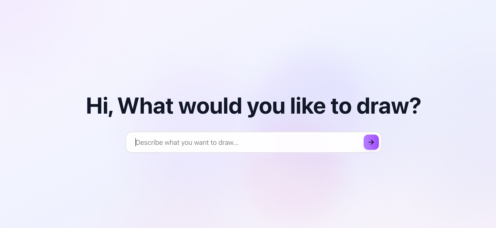

# LazyDraw - AI 智能图表生成工具

一个基于 AI 技术的智能图表生成工具，能够将自然语言描述转换为专业的 Mermaid 图表代码，并提供实时渲染和编辑功能。

## 🚀 项目特色

- **智能文本转图表**：使用 AI 将自然语言描述转换为 Mermaid 图表代码
- **多图表类型支持**：支持流程图、序列图、甘特图等多种图表类型
- **双渲染模式**：支持 Mermaid 原生渲染和 Excalidraw 手绘风格渲染
- **现代化界面**：基于 YouMind 设计风格的简洁现代界面
- **响应式设计**：完美适配桌面端和移动端
- **流畅动画**：使用 Framer Motion 提供流畅的交互动画

## 📸 项目截图



*LazyDraw 主界面展示 - 现代化的 AI 图表生成工具，具有优雅的紫色主题和动态波浪背景*

## 🛠️ 技术栈

- **前端框架**：Next.js 15 + React 18
- **UI 组件库**：shadcn/ui + Radix UI
- **样式系统**：Tailwind CSS v4
- **动画库**：Framer Motion
- **图标库**：Lucide React
- **类型安全**：TypeScript

## 📦 安装和运行

### 环境要求

- Node.js 18.x 或更高版本
- npm 或 yarn 包管理工具

### 安装步骤

1. **克隆项目**
```bash
git clone <repository-url>
cd LazyDraw
```

2. **安装依赖**
```bash
npm install
```

3. **启动开发服务器**
```bash
npm run dev
```

4. **访问应用**
打开浏览器访问 [http://localhost:3000](http://localhost:3000)

## 🎨 界面预览

项目实现了类似 YouMind 的现代化界面设计：

- **主页面**：大标题 + 副标题的布局
- **输入框**：居中的搜索输入框，支持主题探索
- **功能按钮**：四个主要功能按钮（Learn、Write、Create、Life）
- **插画元素**：右侧的动态插画，包含人物和装饰元素
- **响应式设计**：适配各种屏幕尺寸

## 📁 项目结构

```
src/
├── app/                    # Next.js App Router
│   ├── layout.tsx         # 根布局
│   ├── page.tsx           # 首页
│   └── globals.css        # 全局样式
├── components/            # 可复用组件
│   ├── ui/               # 基础 UI 组件
│   │   ├── button.tsx    # 按钮组件
│   │   └── input.tsx     # 输入框组件
│   ├── HeroIllustration.tsx # 主页面插画
│   └── Layout.tsx        # 布局组件
└── lib/                  # 工具库
    └── utils.ts          # 工具函数
```

## 🎯 核心功能

### 1. 智能文本转图表
- 支持自然语言输入
- AI 驱动的图表类型识别
- 实时代码生成和预览

### 2. 多图表类型支持
- 流程图 (Flowchart)
- 序列图 (Sequence Diagram)
- 甘特图 (Gantt Chart)
- 类图 (Class Diagram)
- 状态图 (State Diagram)
- 用户旅程图 (User Journey)

### 3. 双渲染模式
- **Mermaid 渲染**：标准的技术图表风格
- **Excalidraw 渲染**：手绘风格，更友好的视觉效果

### 4. 文件处理
- 支持上传 .txt、.md、.docx 文件
- 批量处理和转换

## 🔧 开发指南

### 添加新功能

1. 在 `src/components/` 目录下创建新组件
2. 使用 TypeScript 和 Tailwind CSS
3. 遵循现有的组件结构和命名规范

### 样式定制

项目使用 Tailwind CSS，可以通过以下方式定制样式：

1. 修改 `tailwind.config.ts` 配置文件
2. 在 `src/app/globals.css` 中添加自定义样式
3. 使用 CSS 变量进行主题定制

### 动画效果

使用 Framer Motion 添加动画效果：

```tsx
import { motion } from "framer-motion";

<motion.div
  initial={{ opacity: 0, y: 20 }}
  animate={{ opacity: 1, y: 0 }}
  transition={{ duration: 0.5 }}
>
  Content
</motion.div>
```

## 📱 响应式设计

项目采用移动优先的响应式设计：

- **移动端**：单列布局，紧凑的间距
- **平板端**：适中的尺寸和间距
- **桌面端**：双列布局，充分利用屏幕空间

## 🚀 部署

### Vercel 部署

1. 将代码推送到 GitHub
2. 在 Vercel 中导入项目
3. 自动部署完成

### Docker 部署

```bash
# 构建镜像
docker build -t lazydraw .

# 运行容器
docker run -p 3000:3000 lazydraw
```

## 🤝 贡献指南

1. Fork 项目
2. 创建功能分支 (`git checkout -b feature/AmazingFeature`)
3. 提交更改 (`git commit -m 'Add some AmazingFeature'`)
4. 推送到分支 (`git push origin feature/AmazingFeature`)
5. 打开 Pull Request

## 📄 许可证

本项目采用 MIT 许可证 - 查看 [LICENSE](LICENSE) 文件了解详情。

## 🙏 致谢

- [YouMind](https://youmind.com/) - 界面设计灵感来源
- [Smart Mermaid](https://github.com/liujuntao123/smart-mermaid) - 功能设计参考
- [Next.js](https://nextjs.org/) - 前端框架
- [Tailwind CSS](https://tailwindcss.com/) - 样式框架
- [Framer Motion](https://www.framer.com/motion/) - 动画库