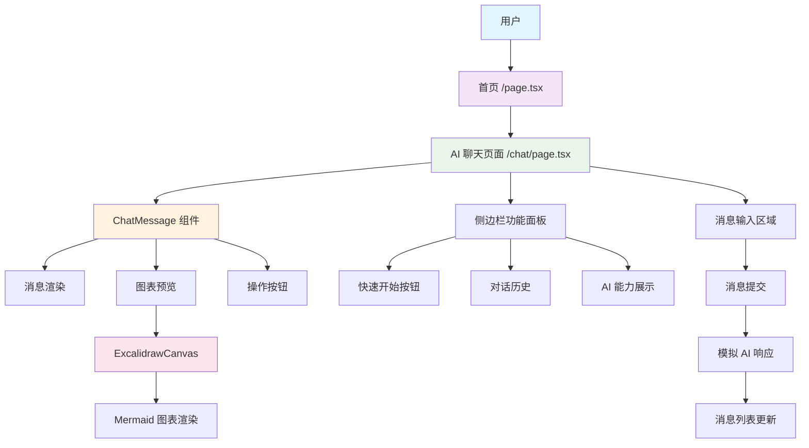
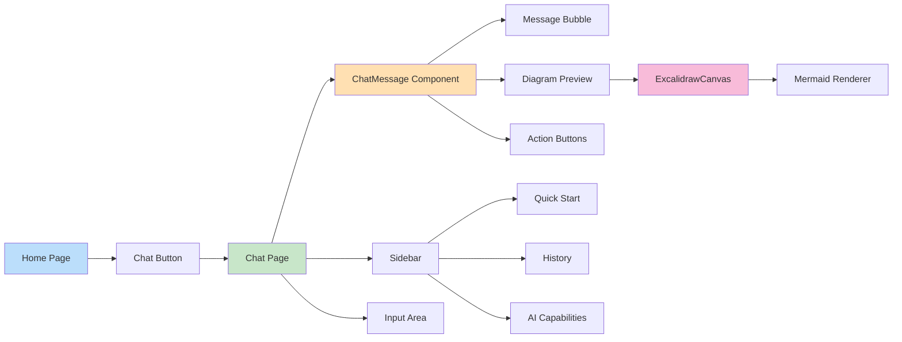
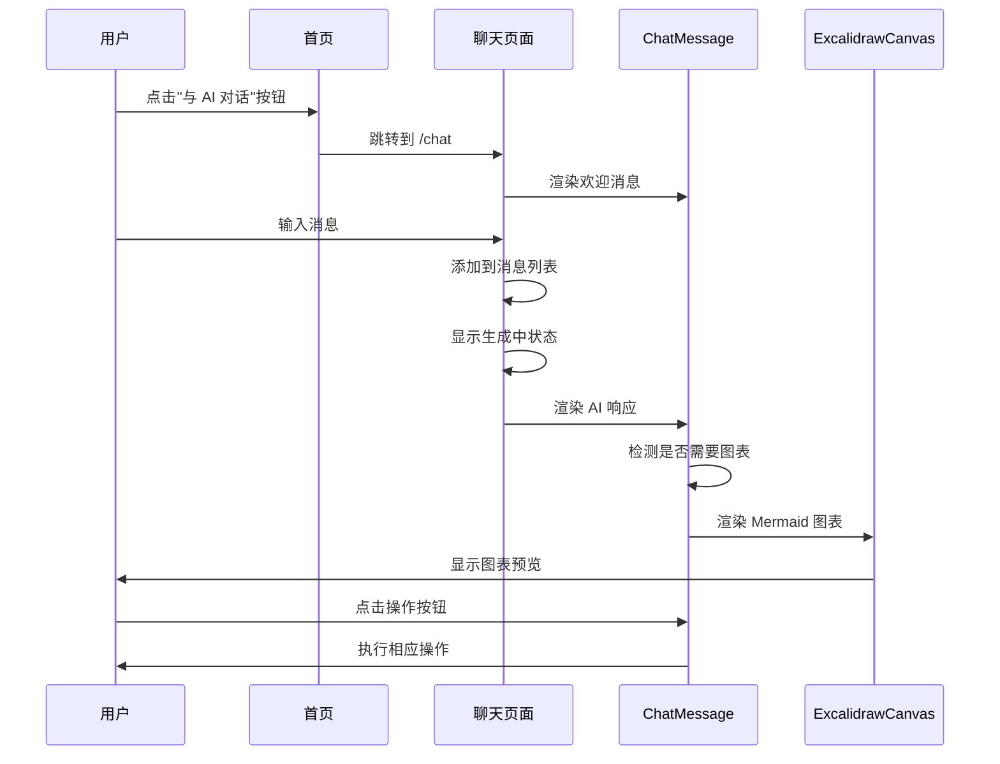

# LazyDraw AI 聊天系统架构图

## 系统架构

## 组件关系图

## 数据流图

## 功能特性

### 1. 首页集成
- 添加了"与 AI 对话"按钮
- 使用 YouMind 风格的渐变设计
- 平滑的动画过渡效果

### 2. 聊天界面
- 类似 Chatbox AI 的对话界面
- 支持用户和 AI 消息的区分显示
- 实时消息生成动画
- 消息操作按钮（复制、点赞、重新生成）

### 3. 图表渲染
- 自动检测消息中的图表需求
- 集成 ExcalidrawCanvas 组件
- 支持 Mermaid 语法渲染
- 可折叠的图表预览面板

### 4. 侧边栏功能
- 快速开始按钮
- 对话历史管理
- AI 能力展示
- YouMind 风格的设计元素

### 5. 响应式设计
- 移动端适配
- 桌面端侧边栏
- 流畅的动画效果
- 现代化的 UI 设计

## 技术栈

- **框架**: Next.js 15
- **样式**: Tailwind CSS
- **动画**: Framer Motion
- **组件**: Radix UI
- **图标**: Lucide React
- **图表**: Excalidraw + Mermaid
- **类型**: TypeScript

## 设计原则

1. **简洁易懂**: 界面简洁，功能清晰
2. **模块化**: 组件可复用，易于维护
3. **响应式**: 适配各种设备尺寸
4. **动画流畅**: 使用 Framer Motion 提供流畅体验
5. **YouMind 风格**: 采用现代化的渐变和毛玻璃效果