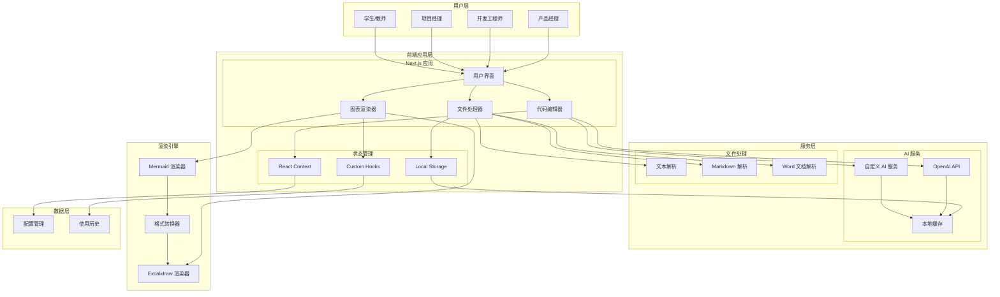
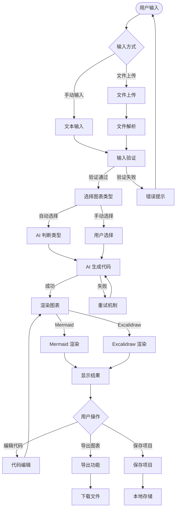
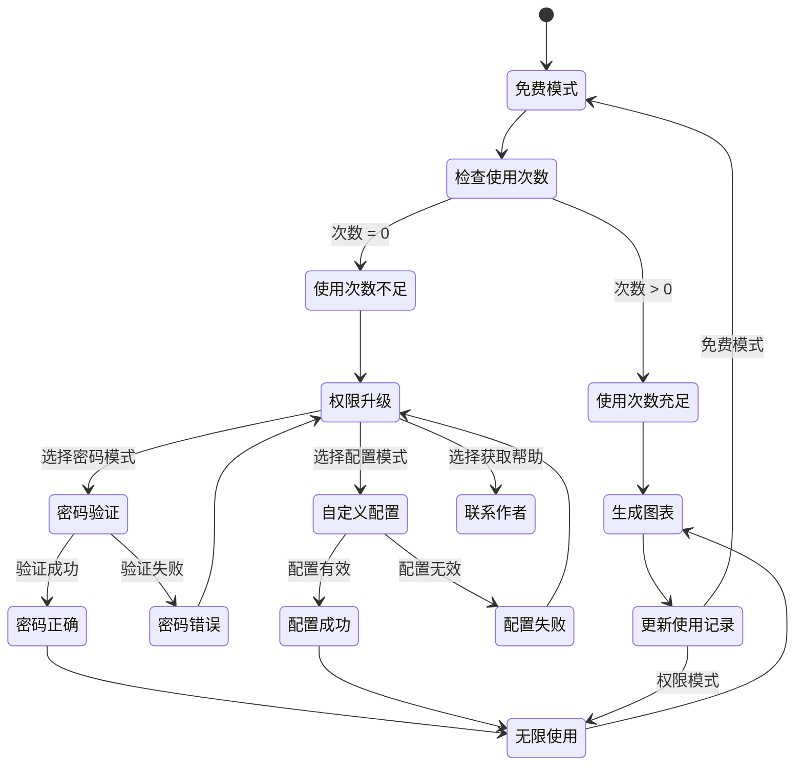
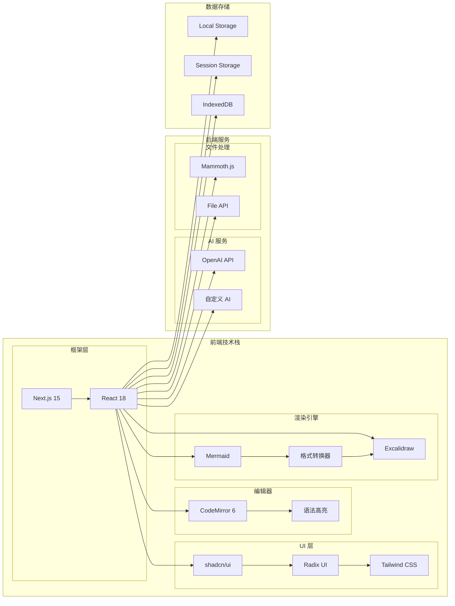
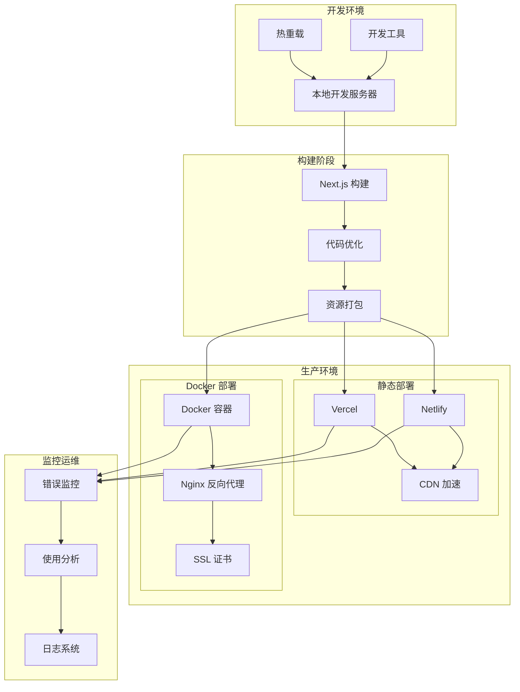

# LazyDraw 系统架构图

## 整体系统架构

```mermaid
graph TB
    subgraph "用户层"
        U1[产品经理]
        U2[开发工程师]
        U3[项目经理]
        U4[学生/教师]
    end
    
    subgraph "前端应用层"
        subgraph "Next.js 应用"
            UI[用户界面]
            Editor[代码编辑器]
            Renderer[图表渲染器]
            FileHandler[文件处理器]
        end
        
        subgraph "状态管理"
            Context[React Context]
            Hooks[Custom Hooks]
            Storage[Local Storage]
        end
    end
    
    subgraph "服务层"
        subgraph "AI 服务"
            OpenAI[OpenAI API]
            Custom[自定义 AI 服务]
            Cache[响应缓存]
        end
        
        subgraph "文件处理"
            Text[文本解析]
            Markdown[Markdown 解析]
            Word[Word 文档解析]
        end
    end
    
    subgraph "渲染引擎"
        Mermaid[Mermaid 渲染器]
        Excalidraw[Excalidraw 渲染器]
        Converter[格式转换器]
    end
    
    subgraph "数据层"
        Config[配置管理]
        History[使用历史]
        Cache[本地缓存]
    end
    
    %% 用户交互
    U1 --> UI
    U2 --> UI
    U3 --> UI
    U4 --> UI
    
    %% 前端内部交互
    UI --> Editor
    UI --> Renderer
    UI --> FileHandler
    Editor --> Context
    Renderer --> Hooks
    FileHandler --> Storage
    
    %% 服务调用
    Editor --> OpenAI
    Editor --> Custom
    FileHandler --> Text
    FileHandler --> Markdown
    FileHandler --> Word
    
    %% 渲染流程
    Renderer --> Mermaid
    Renderer --> Excalidraw
    Mermaid --> Converter
    Converter --> Excalidraw
    
    %% 数据流
    Context --> Config
    Hooks --> History
    Storage --> Cache
    
    %% 缓存机制
    OpenAI --> Cache
    Custom --> Cache
```

## 核心功能流程图

```mermaid
flowchart TD
    Start([用户输入]) --> Input{输入方式}
    
    Input -->|手动输入| TextInput[文本输入]
    Input -->|文件上传| FileUpload[文件上传]
    
    TextInput --> Validate[输入验证]
    FileUpload --> Parse[文件解析]
    Parse --> Validate
    
    Validate -->|验证通过| SelectType[选择图表类型]
    Validate -->|验证失败| Error[错误提示]
    
    SelectType -->|自动选择| AISelect[AI 判断类型]
    SelectType -->|手动选择| ManualSelect[用户选择]
    
    AISelect --> Generate[AI 生成代码]
    ManualSelect --> Generate
    
    Generate -->|成功| Render[渲染图表]
    Generate -->|失败| Retry[重试机制]
    
    Render -->|Mermaid| MermaidRender[Mermaid 渲染]
    Render -->|Excalidraw| ExcalidrawRender[Excalidraw 渲染]
    
    MermaidRender --> Display[显示结果]
    ExcalidrawRender --> Display
    
    Display --> Edit{用户操作}
    
    Edit -->|编辑代码| CodeEdit[代码编辑]
    Edit -->|导出图表| Export[导出功能]
    Edit -->|保存项目| Save[保存项目]
    
    CodeEdit --> Render
    Export --> Download[下载文件]
    Save --> Storage[本地存储]
    
    Error --> Start
    Retry --> Generate
```

## 权限管理架构

```mermaid
stateDiagram-v2
    [*] --> 免费模式
    
    免费模式 --> 检查使用次数
    检查使用次数 --> 使用次数充足: 次数 > 0
    检查使用次数 --> 使用次数不足: 次数 = 0
    
    使用次数充足 --> 生成图表
    使用次数不足 --> 权限升级
    
    权限升级 --> 密码验证: 选择密码模式
    权限升级 --> 自定义配置: 选择配置模式
    权限升级 --> 联系作者: 选择获取帮助
    
    密码验证 --> 密码正确: 验证成功
    密码验证 --> 密码错误: 验证失败
    密码错误 --> 权限升级
    
    密码正确 --> 无限使用
    自定义配置 --> 配置成功: 配置有效
    自定义配置 --> 配置失败: 配置无效
    配置失败 --> 权限升级
    
    配置成功 --> 无限使用
    无限使用 --> 生成图表
    
    生成图表 --> 更新使用记录
    更新使用记录 --> 免费模式: 免费模式
    更新使用记录 --> 无限使用: 权限模式
```

## 技术栈架构

```mermaid
graph LR
    subgraph "前端技术栈"
        subgraph "框架层"
            NextJS[Next.js 15]
            React[React 18]
        end
        
        subgraph "UI 层"
            Shadcn[shadcn/ui]
            Radix[Radix UI]
            Tailwind[Tailwind CSS]
        end
        
        subgraph "编辑器"
            CodeMirror[CodeMirror 6]
            Syntax[语法高亮]
        end
        
        subgraph "渲染引擎"
            MermaidLib[Mermaid]
            ExcalidrawLib[Excalidraw]
            ConverterLib[格式转换器]
        end
    end
    
    subgraph "后端服务"
        subgraph "AI 服务"
            OpenAIService[OpenAI API]
            CustomService[自定义 AI]
        end
        
        subgraph "文件处理"
            Mammoth[Mammoth.js]
            FileAPI[File API]
        end
    end
    
    subgraph "数据存储"
        LocalStorage[Local Storage]
        SessionStorage[Session Storage]
        IndexedDB[IndexedDB]
    end
    
    NextJS --> React
    React --> Shadcn
    Shadcn --> Radix
    Radix --> Tailwind
    
    React --> CodeMirror
    CodeMirror --> Syntax
    
    React --> MermaidLib
    React --> ExcalidrawLib
    MermaidLib --> ConverterLib
    ConverterLib --> ExcalidrawLib
    
    React --> OpenAIService
    React --> CustomService
    React --> Mammoth
    React --> FileAPI
    
    React --> LocalStorage
    React --> SessionStorage
    React --> IndexedDB
```

## 部署架构

```mermaid
graph TB
    subgraph "开发环境"
        Dev[本地开发服务器]
        HotReload[热重载]
        DevTools[开发工具]
    end
    
    subgraph "构建阶段"
        Build[Next.js 构建]
        Optimize[代码优化]
        Bundle[资源打包]
    end
    
    subgraph "生产环境"
        subgraph "静态部署"
            Vercel[Vercel]
            Netlify[Netlify]
            CDN[CDN 加速]
        end
        
        subgraph "Docker 部署"
            Container[Docker 容器]
            Nginx[Nginx 反向代理]
            SSL[SSL 证书]
        end
    end
    
    subgraph "监控运维"
        Sentry[错误监控]
        Analytics[使用分析]
        Logs[日志系统]
    end
    
    Dev --> Build
    HotReload --> Dev
    DevTools --> Dev
    
    Build --> Optimize
    Optimize --> Bundle
    
    Bundle --> Vercel
    Bundle --> Netlify
    Bundle --> Container
    
    Vercel --> CDN
    Netlify --> CDN
    Container --> Nginx
    Nginx --> SSL
    
    Vercel --> Sentry
    Netlify --> Sentry
    Container --> Sentry
    
    Sentry --> Analytics
    Analytics --> Logs
```
