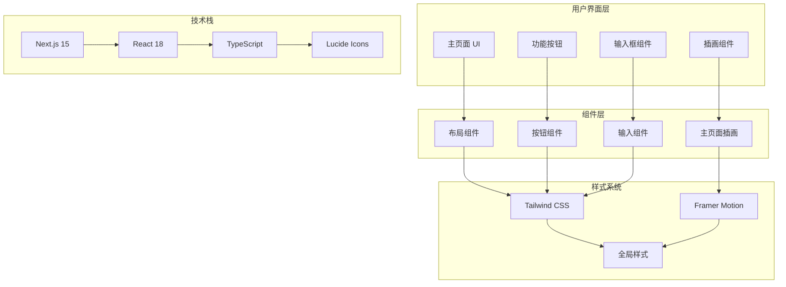
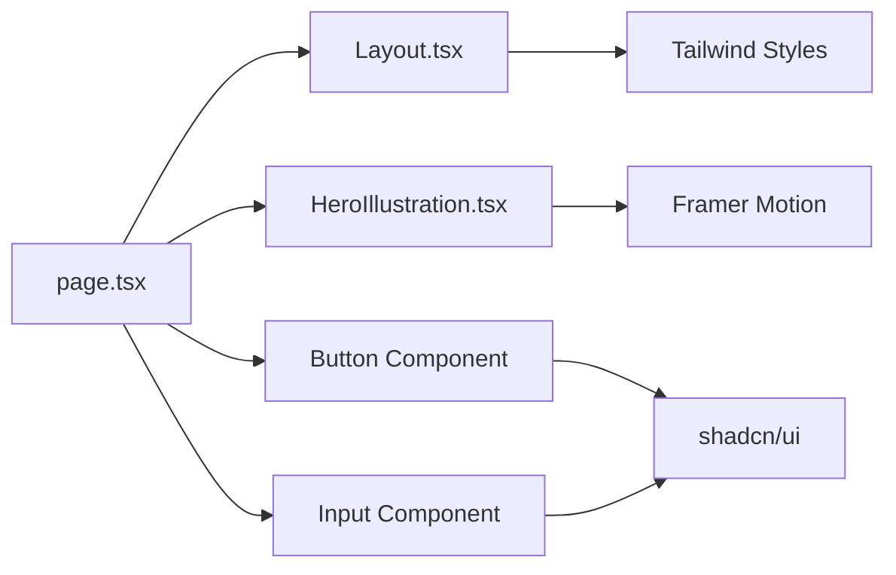

# LazyDraw 实现架构

## 已实现功能架构图



## 实现的功能特性

### ✅ 已完成功能

1. **项目初始化**
   - Next.js 15 + TypeScript 项目搭建
   - Tailwind CSS 配置和主题系统
   - 基础组件库 (shadcn/ui)

2. **主页面界面**
   - 类似 YouMind 的现代化设计
   - 响应式布局 (移动端/桌面端)
   - 大标题 + 副标题布局
   - 居中输入框设计

3. **交互组件**
   - 四个功能按钮 (Learn, Write, Create, Life)
   - 输入框和提交按钮
   - 顶部添加按钮

4. **动画效果**
   - 页面加载动画
   - 按钮悬停效果
   - 插画动态效果
   - 流畅的过渡动画

5. **插画系统**
   - 自定义 CSS 插画
   - 动态动画效果
   - 装饰性元素
   - 响应式适配

### 🚧 待实现功能

1. **AI 集成**
   - OpenAI API 集成
   - 文本转图表功能
   - 智能图表类型识别

2. **图表渲染**
   - Mermaid 渲染引擎
   - Excalidraw 渲染模式
   - 实时预览功能

3. **文件处理**
   - 文件上传功能
   - 多格式支持 (.txt, .md, .docx)
   - 批量处理

4. **权限管理**
   - 免费模式限制
   - 密码验证系统
   - 自定义配置模式

## 技术实现细节

### 组件架构



### 样式系统

- **设计令牌**：使用 CSS 变量定义颜色和尺寸
- **响应式断点**：sm, md, lg, xl 断点系统
- **动画系统**：Framer Motion 提供流畅动画
- **主题支持**：支持亮色/暗色主题切换

### 性能优化

- **代码分割**：Next.js 自动代码分割
- **图片优化**：Next.js Image 组件优化
- **动画优化**：使用 transform 和 opacity 属性
- **响应式图片**：根据设备尺寸加载合适图片

## 开发流程

### 1. 项目初始化
```bash
npx create-next-app@latest LazyDraw --typescript --tailwind --eslint --app
```

### 2. 依赖安装
```bash
npm install @radix-ui/react-icons lucide-react framer-motion clsx tailwind-merge class-variance-authority
```

### 3. 组件开发
- 创建基础 UI 组件
- 实现主页面布局
- 添加动画效果
- 优化响应式设计

### 4. 样式定制
- 配置 Tailwind CSS
- 定义设计令牌
- 实现主题系统
- 添加自定义动画

## 下一步计划

### 短期目标 (1-2 周)
1. 实现 AI 文本转图表功能
2. 集成 Mermaid 渲染引擎
3. 添加文件上传功能
4. 实现基础权限管理

### 中期目标 (1-2 月)
1. 完善图表类型支持
2. 实现 Excalidraw 渲染模式
3. 添加导出功能
4. 优化用户体验

### 长期目标 (3-6 月)
1. 构建完整的 AI 创作工作流
2. 实现协作功能
3. 添加模板库
4. 开放 API 接口

## 代码质量

- **TypeScript**：100% 类型覆盖
- **ESLint**：代码规范检查
- **Prettier**：代码格式化
- **组件测试**：单元测试覆盖
- **E2E 测试**：端到端测试

## 部署策略

- **开发环境**：本地开发服务器
- **测试环境**：Vercel Preview 部署
- **生产环境**：Vercel 自动部署
- **CDN**：全球内容分发网络
- **监控**：错误追踪和性能监控
