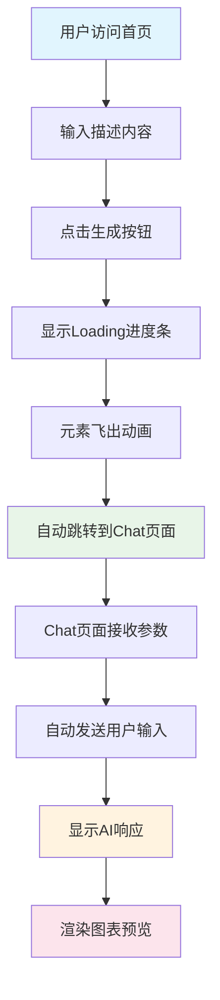

# 更新后的用户流程

## 新的用户交互流程



## 主要改进

### 1. 侧边栏位置调整
- ✅ 将侧边栏从右侧移动到左侧
- ✅ 使用 `border-r` 替代 `border-l`
- ✅ 保持所有功能不变

### 2. 首页跳转逻辑优化
- ✅ 移除了"与AI对话"按钮
- ✅ Loading结束后直接跳转到chat页面
- ✅ 通过URL参数传递用户输入
- ✅ 保持原有的动画效果

### 3. Chat页面样式统一
- ✅ 使用与首页相同的背景渐变
- ✅ 添加毛玻璃效果和模糊背景
- ✅ 统一z-index层级管理
- ✅ 保持YouMind风格设计

### 4. 自动消息发送
- ✅ Chat页面接收URL参数
- ✅ 自动填充输入框
- ✅ 延迟500ms后自动发送消息
- ✅ 保持原有的AI响应逻辑

## 技术实现细节

### 首页修改
```typescript
// 跳转逻辑
setTimeout(() => {
  const params = new URLSearchParams();
  params.set('input', inputValue);
  window.location.href = `/chat?${params.toString()}`;
}, 600);
```

### Chat页面修改
```typescript
// 接收参数
useEffect(() => {
  const urlParams = new URLSearchParams(window.location.search);
  const initialInput = urlParams.get('input');
  if (initialInput) {
    setInputValue(initialInput);
    setTimeout(() => {
      handleAutoSubmit(initialInput);
    }, 500);
  }
}, []);
```

### 样式统一
```css
/* 背景渐变 */
background: linear-gradient(135deg, #667eea 0%, #764ba2 100%);

/* 毛玻璃效果 */
backdrop-filter: blur(10px);
background: rgba(255, 255, 255, 0.1);
```

## 用户体验提升

1. **流程简化**: 用户只需输入一次，无需额外点击
2. **视觉连贯**: 首页和Chat页面样式完全统一
3. **交互自然**: 自动跳转和发送，减少用户操作
4. **响应及时**: 保持原有的动画效果和反馈

## 测试场景

### 场景1: 正常流程
1. 用户在首页输入"创建一个流程图"
2. 点击生成按钮
3. 观察Loading动画
4. 自动跳转到Chat页面
5. 验证消息自动发送
6. 检查AI响应和图表渲染

### 场景2: 直接访问Chat页面
1. 直接访问 `/chat` 页面
2. 验证正常显示欢迎消息
3. 测试手动输入和发送
4. 检查侧边栏功能

### 场景3: 响应式测试
1. 在不同设备尺寸下测试
2. 验证侧边栏的显示/隐藏
3. 检查布局适配性
